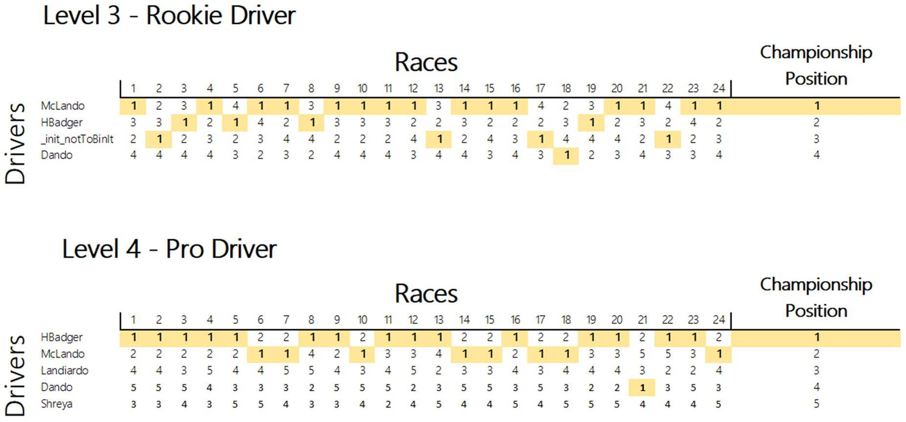

# McLaren Maze Race

## The Rookie challenge winning solution

This fork of the McLaren Maze Race repo contains the winning solution for the Rookie Challenge.

Directory `nikola/` includes various testing and probing scripts that start with a number for easier management. It also includes separate modules that tackle different aspects of the challenge. The most useful tool would be the `race_logger.py`, which allows for detailed per-step performance inspection.


Submitted solutions are placed inside `drivers/` directory together with the original example drivers, starting with `my_`. They are created by combining the above-mentioned modules. Files marked with `_2` are the final submissions, `my_rookie_driver_2.py` being the winning solution.

To pit the first and the second Rookie submission against each other and the original Rookie example, run:
```
python3 nikola/46_rookie_submission_1_vs_2.py
```
The output will be placed in the `nikola/nikola/46_rookie_submission_1_vs_2/` directory and will include visual race logs for each driver and each race, as well as a text file describing who won which race and what were the times.

Here are the final leaderboards showing the placement of our driver `McLando`:



## Intro

Welcome to the McLaren Maze Race!

This is half a fun introduction to Artificial Intelligence (AI) and Machine Learning suitable for all ages and abilities and half a challenge for anyone who wants to test their AI skills! So whether you are an AI newbie or a total pro you should find something here for you.

The Maze Race was created to go alongside season 2 of McLaren Substitute Teacher, a collaboration with Dell Technologies. You can watch the videos on the <a
            href="https://www.youtube.com/channel/UC8dxVgZl9u5HeCOXnosCtuQ">McLaren YouTube channel</a>.

As you move through the four levels of the Maze Race you will build an AI capable of learning to drive a car, navigate a maze, deal with F1 features such as the safety car, DRS and pit stops, and master racing in the rain. You can choose just to read through the explanations, to run the interactive code snippets and watch the AI learn, or to get involved and try to improve the AI to achieve even better results.

The Maze Race introduces several key aspects of AI/Machine Learning, whilst also presenting a fun challenge. If you work through all the levels you will implement algorithms from across the field of AI: supervised learning, unsupervised learning, and reinforcement learning.

Once you complete level 3, "Rookie Driver", you will be able to submit your own code to the online challenge below. This will pit your AI driver against other drivers from across the world to fight it out for the Maze Race Championship title. The best submitted code will also win an official McLaren team polo shirt signed by both our drivers. See the McLaren Maze Race website for more details.

## Getting started

The main interaction points are a series of Jupyter notebooks, one for each level. There are various ways you can get stuck in:

• <a href="https://mybinder.org/v2/gh/mclaren-maze-race/mclaren-maze-race/HEAD">View and run the notebooks on MyBinder</a>. You will be able to run through all the levels, reading the explanations and running the code examples to see the AI learn. You won't be able to save any edits you make though, so if you want to get stuck into designing your own AI then you will need the next option.

• Download the repository from GitHub. This gives you full access to all the code and you can run and edit it on your own computer. You will need Python installed on your computer, but look out for the "getting_started.txt" text file, which will walk you through all the steps you need to take.

Once you reach level 3 you can take part in the **Maze Race Challenge** - race your AI driver against others from across the world. The fastest driver wins an exclusive McLaren prize. For more details, see the [McLaren Maze Race website](https://www.mclaren.com/mazerace)

Have fun and [let us know how you get on!](https://forms.office.com/Pages/ResponsePage.aspx?id=1D5YJvyfwkadGvDKNaMKjclg_cyBBFJPg8x5VJ87DGJUNlNFTlVHS05LTUpKRk8xR04zOFVORFg3VS4u)
